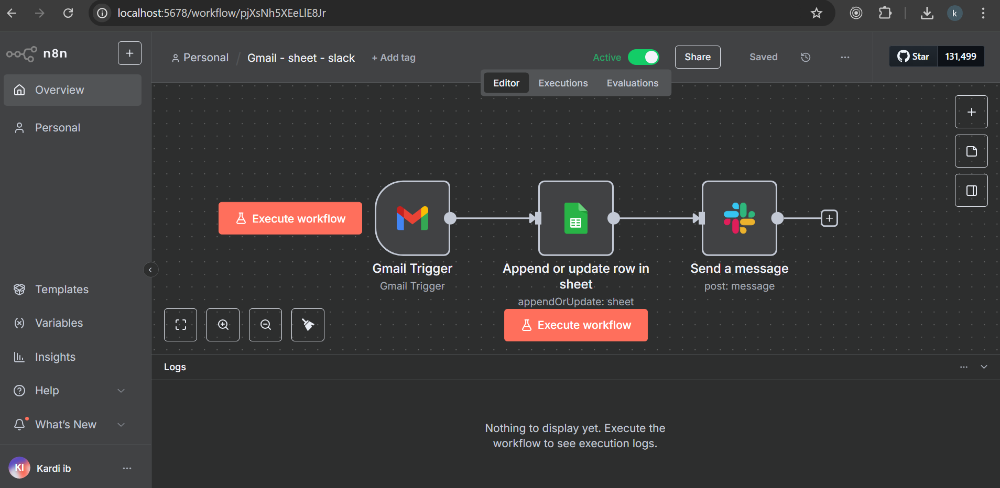

# Workflow: Gmail → Google Sheets → Slack

## 📌 Deskripsi
Workflow ini mengambil email baru dari Gmail, menyimpannya ke Google Sheets, lalu mengirim notifikasi ke Slack channel #sales.

## 🚀 Alur
1. **Gmail Trigger**: Mendeteksi email masuk dengan subject "Inquiry".
2. **Google Sheets**: Menyimpan sender, subject, dan tanggal.
3. **Slack**: Mengirim notifikasi ke channel #jerpon-all.

## 🛠️ Node Detail
| Node | Fungsi | Konfigurasi |
|------|---------|-------------|
| Gmail Trigger | Memicu workflow | Subject contains "Inquiry" |
| Google Sheets | Append row | Spreadsheet: `Sheet1` |
| Slack | Send Message | Channel: #jerpon-all |

## 📷 Screenshot

## 📂 File
- [workflow.json](./workflow.json) → bisa langsung diimport ke n8n.

## ✅ Output
- Google Sheets berisi log email.  
- Slack channel menerima pesan otomatis: